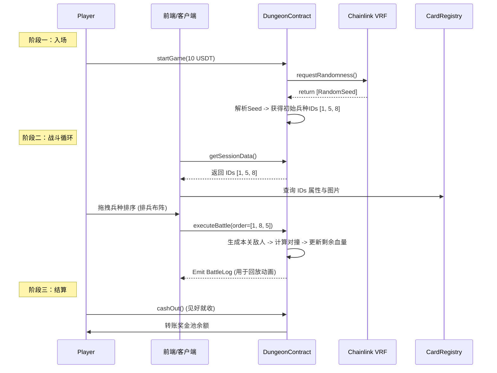

# ⚔️ Ether Dungeon: Endless Siege (无尽地牢：围攻) - 游戏设计与架构文档

**版本**: v1.0  
**日期**: 2026-02-10  
**类型**: Web3 GameFi / Roguelike Auto-Battler  
**兼容链**: EVM (Ethereum, Arbitrum, Base) & Solana (可选扩展)

---

## 1. 🎯 项目愿景与设计理念

本项目旨在复现并创新一个基于区块链技术的 **PvE 生存闯关游戏**。结合 Roguelike 的高风险博弈与自走棋的策略性，满足区块链课程开发要求（可验证随机数、代币经济、NFT），同时提供通过策略影响结果的深度游戏体验。

### 核心体验 (Core Loop)

**"贪婪是唯一的敌人。"**

玩家带领一支初始军团进入无限深渊。每通过一关，奖金池叠加，敌人变强。玩家需要在每一关结束后做出抉择：

- **撤退 (Cash Out)**：安全带走当前奖金。
- **继续 (Next Level)**：冒着本局归零的风险，博取更高倍率的收益。

---

## 2. 🎮 游戏策划方案 (Game Design)

### 2.1 游戏流程

1.  **入场 (Entry)**：
    - 玩家支付稳定币（如 USDT/USDC）作为门票（本金）。
    - 本金进入游戏的 **奖金池 (Jackpot)**。
    - 调用 **Chainlink VRF** 获取随机种子。

2.  **招募 (Recruit)**：
    - 根据随机种子，系统从数据库中抽取这局游戏的初始兵力（例如 3 个单位）。
    - _注：卡牌属性固定，ID 随机。例：抽到ID#10 (兽人战士)，ID#05 (弓箭手)。_

3.  **闯关战斗 (The Siege)**：
    - **排兵布阵**：玩家在前端拖拽调整单位站位（队列顺序）。
    - **自动对撞**：提交阵容上链，与当前关卡的 AI 敌人队列进行自动战斗。
    - **判定**：
      - **全灭**：闯关失败，奖金清零，Session 结束。
      - **存活**：闯关成功，当前奖金池增加系数奖励。存活兵力保留血量进入下一关。

4.  **休整与抉择 (Rest & Choice)**：
    - 每通过特定关卡（Level 1, 2, 3...）：
    - 玩家可选择 **结算离场** 或 **进入下一层**。
    - **事件 (Events)**：在特定层数提供“花费奖金购买补给”或“复活单位”的机会。

### 2.2 战斗机制 (Battle Mechanics)

采用类似《炉石传说：酒馆战棋》的简化版 **“队列对撞”** 机制，适应 EVM 计算成本。

- **属性**：攻击力 (ATK), 生命值 (HP)。
- **规则**：
  1.  双方单位排成一列 (Array)。
  2.  `玩家[0]` 与 `敌方[0]` 同时攻击对方。
  3.  `HP_new = HP_old - Enemy_ATK`。
  4.  HP <= 0 的单位死亡（移出队列）。
  5.  幸存者继续与对方下一位单位战斗，直到一方队列为空。
- **策略点**：
  - **肉盾在前**：放置高防低攻单位吸收伤害。
  - **输出在后**：保护高攻脆皮单位收割残局。

### 2.3 资产系统 (Assets)

- **卡牌 (Cards)**：
  - 在游戏过程中，卡牌仅为 Session 中的数据（虚拟资产）。
  - **铸造 (Mint)**：仅当玩家选择结算且达成特定成就时，允许付费将幸存的“MVP卡牌”铸造成真正的 ERC-721 NFT，用作纪念或在未来对局中作为特殊佣兵。
- **卡牌数据库 (Registry)**：
  - 卡牌属性（攻防、种族）存储在链上数据库中，而非每次随机生成。保证了游戏的平衡性和可调整性。

---

## 3. 🏗️ 技术架构设计 (Technical Architecture)

### 3.1 技术栈 (Tech Stack)

- **智能合约**: Solidity (Foundry 框架)
- **前端**: Next.js + RainbowKit + Wagmi
- **预言机**: Chainlink VRF V2.5 (生成随机关卡和初始手牌)
- **合约标准**: ERC-20 (用于支付), ERC-721 (用于纪念卡牌)

### 3.2 智能合约模块

我们需要开发以下三个核心合约：

#### A. `CardRegistry.sol` (配置中心)

- **职责**：存储所有兵种的基础属性。
- **数据结构**：
  ```solidity
  struct UnitStats {
      string name;
      uint16 baseAtk;
      uint16 baseHp;
      // uint8 abilityId; // 预留技能ID
  }
  mapping(uint256 => UnitStats) public unitLibrary;
  ```
- **特点**：类似查表法，极大降低 Gas，只需存储 ID。

#### B. `DungeonEngine.sol` (核心逻辑)

- **职责**：处理游戏循环、战斗计算、资金管理。
- **核心函数**：
  - `startGame(uint256 amount)`: 质押代币 -> 请求 VRF。
  - `fulfillRandomWords(...)`: Chainlink 回调 -> 初始化 Session (玩家 ID 列表)。
  - `battle(uint256[] memory squadIndices)`: 玩家提交站位 -> 链上计算战斗 -> 更新状态 (Level++, HP--)。
  - `cashOut()`: 结算 -> 发送奖励 -> 销毁 Session。

#### C. `DungeonNFT.sol` (战利品)

- **职责**：标准的 ERC-721。
- **交互**：只有 `DungeonEngine` 有权限调用 `mint`。

### 3.3 数据流图 (Data Flow)



---

## 4. 📅 开发路线图 (Roadmap)

### Phase 1: 原型与核心逻辑 (Core Logic)

- [ ] 搭建 Foundry 开发环境。
- [ ] 编写 `CardRegistry` 并录入 10 种基础卡牌数据。
- [ ] 编写 `DungeonEngine` 的核心战斗算法（纯 Solidity 实现 `pvp_simulation`）。
- [ ] 编写单元测试验证战斗逻辑的正确性（确保不会 Gas 超标）。

### Phase 2: 链上集成 (Integration)

- [ ] 集成 Chainlink VRF，实现真正的随机抽卡。
- [ ] 集成 ERC-20 支付网关（存取款逻辑）。
- [ ] 完善 Session 状态管理（如何跨 Block 保存玩家进度）。

### Phase 3: 前端与体验 (Frontend & UX)

- [ ] 脚手架搭建 (Next.js)。
- [ ] 编写“战斗回放器”：解析链上日志，在屏幕上播放攻击动画。
- [ ] 连接钱包与合约交互。

### Phase 4: 测试网发布 (Deploy)

- [ ] 部署至 Sepolia / Arbitrum Sepolia。
- [ ] 生成文档与演示视频。
